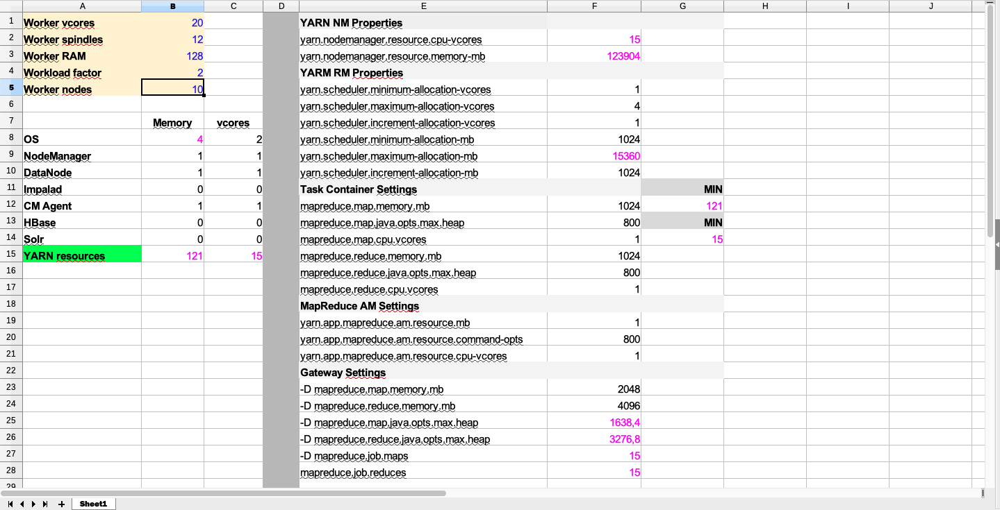

12 GB for the OS seem to be too much I set it to 4 GB. The maximum number of vcores we can use is of 15 vcores per Worker, if I change Workload factor to 1 the worker is under used, but if I change to factor greater than 2 there aren't sufficient vcores to accomplish the jobs, so 2 is the maximum number I can use for the Workload factor.

The Workload factor is limited by the installed CPU per Worker.

I leave unchanged all the other default values.

