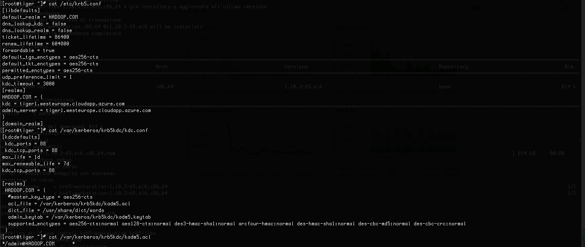

# kinit



# klist

```
[root@tiger ~]# klist
Ticket cache: FILE:/tmp/krb5cc_0
Default principal: admin/admin@HADOOP.COM

Valid starting     Expires            Service principal
10/17/18 11:20:43  10/18/18 11:20:43  krbtgt/HADOOP.COM@HADOOP.COM
	renew until 10/17/18 11:20:43
```

