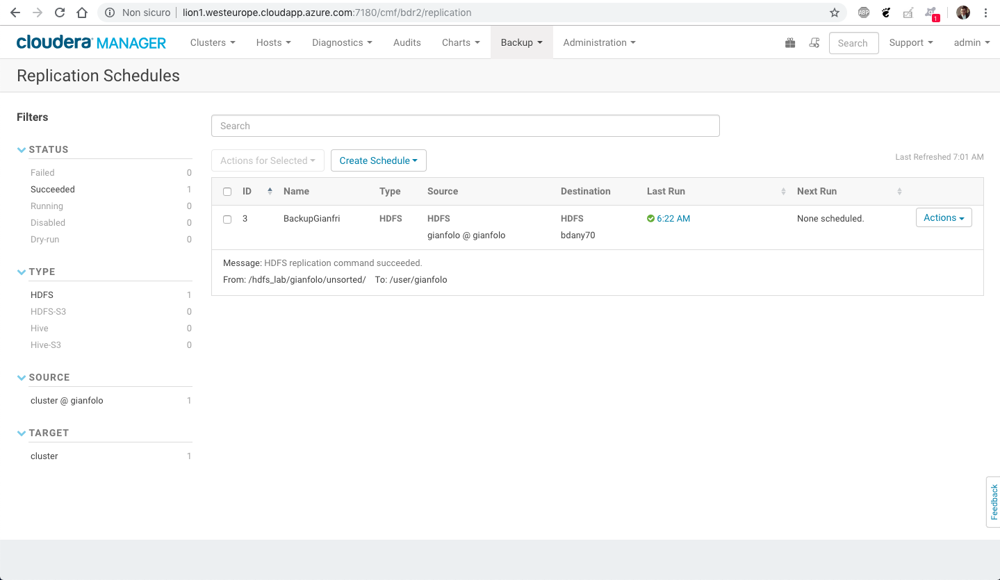

### Create directory for parter and I

```shell
[hdfs@elephant ~]$ hadoop fs -mkdir /user/bdany70
[hdfs@elephant ~]$ hadoop fs -mkdir /user/gianfolo
```


### Generate file with teragen

```shell
[hdfs@elephant ~]$ time hadoop jar /opt/cloudera/parcels/CDH/jars/hadoop-examples.jar teragen -Dmapred.map.tasks=1 5242880 /user/bdany70/unsorted 2>&1 | tee teragen_$(date +'%Y%m%d_%H%M%S')
18/10/16 04:22:00 INFO client.RMProxy: Connecting to ResourceManager at elephant/10.0.0.7:8032
18/10/16 04:22:01 INFO terasort.TeraGen: Generating 5242880 using 1
18/10/16 04:22:01 INFO mapreduce.JobSubmitter: number of splits:1
18/10/16 04:22:01 INFO Configuration.deprecation: mapred.map.tasks is deprecated. Instead, use mapreduce.job.maps
18/10/16 04:22:02 INFO mapreduce.JobSubmitter: Submitting tokens for job: job_1539626853206_0001
18/10/16 04:22:02 INFO impl.YarnClientImpl: Submitted application application_1539626853206_0001
18/10/16 04:22:02 INFO mapreduce.Job: The url to track the job: http://elephant:8088/proxy/application_1539626853206_0001/
18/10/16 04:22:02 INFO mapreduce.Job: Running job: job_1539626853206_0001
18/10/16 04:22:09 INFO mapreduce.Job: Job job_1539626853206_0001 running in uber mode : false
18/10/16 04:22:09 INFO mapreduce.Job:  map 0% reduce 0%
18/10/16 04:22:23 INFO mapreduce.Job:  map 100% reduce 0%
18/10/16 04:22:23 INFO mapreduce.Job: Job job_1539626853206_0001 completed successfully
18/10/16 04:22:23 INFO mapreduce.Job: Counters: 31
	File System Counters
		FILE: Number of bytes read=0
		FILE: Number of bytes written=147603
		FILE: Number of read operations=0
		FILE: Number of large read operations=0
		FILE: Number of write operations=0
		HDFS: Number of bytes read=82
		HDFS: Number of bytes written=524288000
		HDFS: Number of read operations=4
		HDFS: Number of large read operations=0
		HDFS: Number of write operations=2
	Job Counters 
		Launched map tasks=1
		Other local map tasks=1
		Total time spent by all maps in occupied slots (ms)=10542
		Total time spent by all reduces in occupied slots (ms)=0
		Total time spent by all map tasks (ms)=10542
		Total vcore-milliseconds taken by all map tasks=10542
		Total megabyte-milliseconds taken by all map tasks=10795008
	Map-Reduce Framework
		Map input records=5242880
		Map output records=5242880
		Input split bytes=82
		Spilled Records=0
		Failed Shuffles=0
		Merged Map outputs=0
		GC time elapsed (ms)=85
		CPU time spent (ms)=11470
		Physical memory (bytes) snapshot=376250368
		Virtual memory (bytes) snapshot=2795823104
		Total committed heap usage (bytes)=378011648
	org.apache.hadoop.examples.terasort.TeraGen$Counters
		CHECKSUM=11257830824958050
	File Input Format Counters 
		Bytes Read=0
	File Output Format Counters 
		Bytes Written=524288000

real	0m24.762s
user	0m7.806s
sys	0m0.538s
```

### Copy file from partner

```shell
[hdfs@elephant ~]$ hadoop distcp hdfs://gianbo01.northeurope.cloudapp.azure.com/hdfs_lab/gianfolo/unsorted/part-m-00000 hdfs://elephant:8020/user/gianfolo
18/10/16 06:03:22 INFO tools.OptionsParser: parseChunkSize: blocksperchunk false
18/10/16 06:03:24 INFO tools.DistCp: Input Options: DistCpOptions{atomicCommit=false, syncFolder=false, deleteMissing=false, ignoreFailures=false, overwrite=false, append=false, useDiff=false, useRdiff=false, fromSnapshot=null, toSnapshot=null, skipCRC=false, blocking=true, numListstatusThreads=0, maxMaps=20, mapBandwidth=100, sslConfigurationFile='null', copyStrategy='uniformsize', preserveStatus=[], preserveRawXattrs=false, atomicWorkPath=null, logPath=null, sourceFileListing=null, sourcePaths=[hdfs://gianbo01.northeurope.cloudapp.azure.com/hdfs_lab/gianfolo/unsorted/part-m-00000], targetPath=hdfs://elephant:8020/user/gianfolo, targetPathExists=true, filtersFile='null', blocksPerChunk=0, copyBufferSize=8192}
18/10/16 06:03:24 INFO client.RMProxy: Connecting to ResourceManager at elephant/10.0.0.7:8032
18/10/16 06:03:24 INFO tools.SimpleCopyListing: Paths (files+dirs) cnt = 1; dirCnt = 0
18/10/16 06:03:24 INFO tools.SimpleCopyListing: Build file listing completed.
18/10/16 06:03:24 INFO Configuration.deprecation: io.sort.mb is deprecated. Instead, use mapreduce.task.io.sort.mb
18/10/16 06:03:24 INFO Configuration.deprecation: io.sort.factor is deprecated. Instead, use mapreduce.task.io.sort.factor
18/10/16 06:03:24 INFO tools.DistCp: Number of paths in the copy list: 1
18/10/16 06:03:25 INFO tools.DistCp: Number of paths in the copy list: 1
18/10/16 06:03:25 INFO client.RMProxy: Connecting to ResourceManager at elephant/10.0.0.7:8032
18/10/16 06:03:25 INFO mapreduce.JobSubmitter: number of splits:1
18/10/16 06:03:25 INFO mapreduce.JobSubmitter: Submitting tokens for job: job_1539683823019_0002
18/10/16 06:03:26 INFO impl.YarnClientImpl: Submitted application application_1539683823019_0002
18/10/16 06:03:26 INFO mapreduce.Job: The url to track the job: http://elephant:8088/proxy/application_1539683823019_0002/
18/10/16 06:03:26 INFO tools.DistCp: DistCp job-id: job_1539683823019_0002
18/10/16 06:03:26 INFO mapreduce.Job: Running job: job_1539683823019_0002
18/10/16 06:03:33 INFO mapreduce.Job: Job job_1539683823019_0002 running in uber mode : false
18/10/16 06:03:33 INFO mapreduce.Job:  map 0% reduce 0%
18/10/16 06:03:49 INFO mapreduce.Job:  map 100% reduce 0%
18/10/16 06:04:15 INFO mapreduce.Job: Job job_1539683823019_0002 completed successfully
18/10/16 06:04:15 INFO mapreduce.Job: Counters: 33
	File System Counters
		FILE: Number of bytes read=0
		FILE: Number of bytes written=151096
		FILE: Number of read operations=0
		FILE: Number of large read operations=0
		FILE: Number of write operations=0
		HDFS: Number of bytes read=524288416
		HDFS: Number of bytes written=524288000
		HDFS: Number of read operations=17
		HDFS: Number of large read operations=0
		HDFS: Number of write operations=4
	Job Counters 
		Launched map tasks=1
		Other local map tasks=1
		Total time spent by all maps in occupied slots (ms)=39687
		Total time spent by all reduces in occupied slots (ms)=0
		Total time spent by all map tasks (ms)=39687
		Total vcore-milliseconds taken by all map tasks=39687
		Total megabyte-milliseconds taken by all map tasks=40639488
	Map-Reduce Framework
		Map input records=1
		Map output records=0
		Input split bytes=115
		Spilled Records=0
		Failed Shuffles=0
		Merged Map outputs=0
		GC time elapsed (ms)=74
		CPU time spent (ms)=8370
		Physical memory (bytes) snapshot=388251648
		Virtual memory (bytes) snapshot=2791129088
		Total committed heap usage (bytes)=379060224
	File Input Format Counters 
		Bytes Read=301
	File Output Format Counters 
		Bytes Written=0
	DistCp Counters
		Bytes Copied=524288000
		Bytes Expected=524288000
		Files Copied=1
```


### Execute BDR



### Verify source and target

```shell
[hdfs@elephant ~]$ hdfs fsck /user/bdany70 -files -blocks
Connecting to namenode via http://elephant:50070/fsck?ugi=hdfs&files=1&blocks=1&path=%2Fuser%2Fbdany70
FSCK started by hdfs (auth:SIMPLE) from /10.0.0.7 for path /user/bdany70 at Tue Oct 16 06:25:20 EDT 2018
/user/bdany70 <dir>
/user/bdany70/unsorted <dir>
/user/bdany70/unsorted/_SUCCESS 0 bytes, 0 block(s):  OK

/user/bdany70/unsorted/part-m-00000 524288000 bytes, 4 block(s):  OK
0. BP-2140426816-10.0.0.7-1539626197576:blk_1073743357_2533 len=134217728 Live_repl=3
1. BP-2140426816-10.0.0.7-1539626197576:blk_1073743358_2534 len=134217728 Live_repl=3
2. BP-2140426816-10.0.0.7-1539626197576:blk_1073743359_2535 len=134217728 Live_repl=3
3. BP-2140426816-10.0.0.7-1539626197576:blk_1073743360_2536 len=121634816 Live_repl=3

Status: HEALTHY
 Total size:	524288000 B
 Total dirs:	2
 Total files:	2
 Total symlinks:		0
 Total blocks (validated):	4 (avg. block size 131072000 B)
 Minimally replicated blocks:	4 (100.0 %)
 Over-replicated blocks:	0 (0.0 %)
 Under-replicated blocks:	0 (0.0 %)
 Mis-replicated blocks:		0 (0.0 %)
 Default replication factor:	3
 Average block replication:	3.0
 Corrupt blocks:		0
 Missing replicas:		0 (0.0 %)
 Number of data-nodes:		4
 Number of racks:		1
FSCK ended at Tue Oct 16 06:25:20 EDT 2018 in 3 milliseconds


The filesystem under path '/user/bdany70' is HEALTHY
[hdfs@elephant ~]$ hdfs fsck /user/gianfolo -files -blocks
Connecting to namenode via http://elephant:50070/fsck?ugi=hdfs&files=1&blocks=1&path=%2Fuser%2Fgianfolo
FSCK started by hdfs (auth:SIMPLE) from /10.0.0.7 for path /user/gianfolo at Tue Oct 16 06:25:42 EDT 2018
/user/gianfolo <dir>
/user/gianfolo/part-m-00000 524288000 bytes, 4 block(s):  OK
0. BP-2140426816-10.0.0.7-1539626197576:blk_1073743597_2773 len=134217728 Live_repl=3
1. BP-2140426816-10.0.0.7-1539626197576:blk_1073743599_2775 len=134217728 Live_repl=3
2. BP-2140426816-10.0.0.7-1539626197576:blk_1073743600_2776 len=134217728 Live_repl=3
3. BP-2140426816-10.0.0.7-1539626197576:blk_1073743601_2777 len=121634816 Live_repl=3

/user/gianfolo/unsorted <dir>
/user/gianfolo/unsorted/_SUCCESS 0 bytes, 0 block(s):  OK

/user/gianfolo/unsorted/part-m-00000 524288000 bytes, 4 block(s):  OK
0. BP-2140426816-10.0.0.7-1539626197576:blk_1073743649_2825 len=134217728 Live_repl=3
1. BP-2140426816-10.0.0.7-1539626197576:blk_1073743650_2826 len=134217728 Live_repl=3
2. BP-2140426816-10.0.0.7-1539626197576:blk_1073743651_2827 len=134217728 Live_repl=3
3. BP-2140426816-10.0.0.7-1539626197576:blk_1073743652_2828 len=121634816 Live_repl=3

Status: HEALTHY
 Total size:	1048576000 B
 Total dirs:	2
 Total files:	3
 Total symlinks:		0 (Files currently being written: 1)
 Total blocks (validated):	8 (avg. block size 131072000 B)
 Minimally replicated blocks:	8 (100.0 %)
 Over-replicated blocks:	0 (0.0 %)
 Under-replicated blocks:	0 (0.0 %)
 Mis-replicated blocks:		0 (0.0 %)
 Default replication factor:	3
 Average block replication:	3.0
 Corrupt blocks:		0
 Missing replicas:		0 (0.0 %)
 Number of data-nodes:		4
 Number of racks:		1
FSCK ended at Tue Oct 16 06:25:42 EDT 2018 in 1 milliseconds


The filesystem under path '/user/gianfolo' is HEALTHY

```
