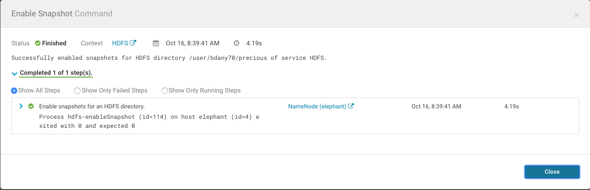
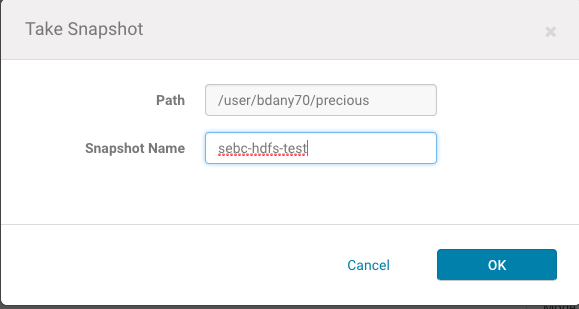
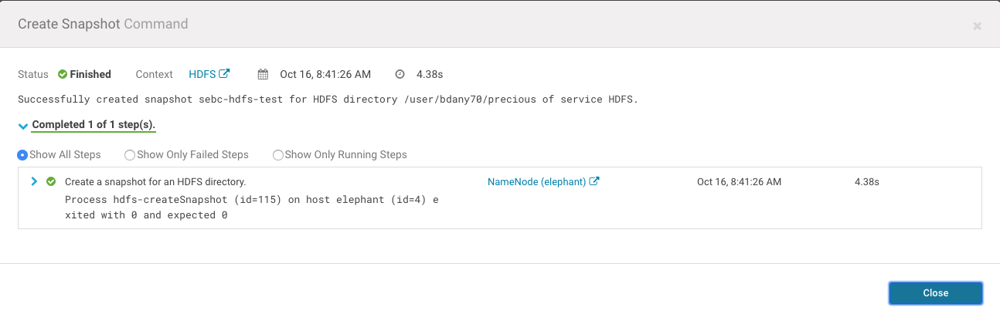
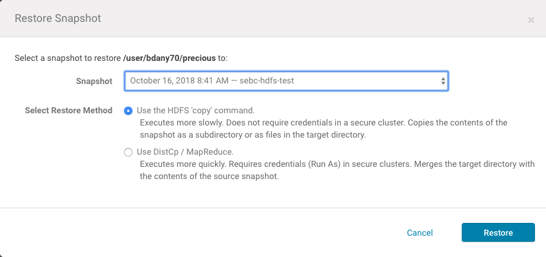
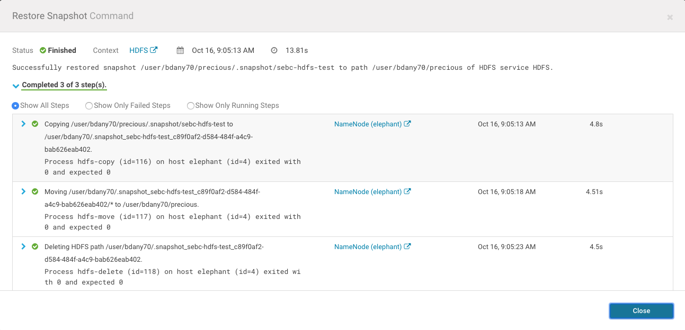
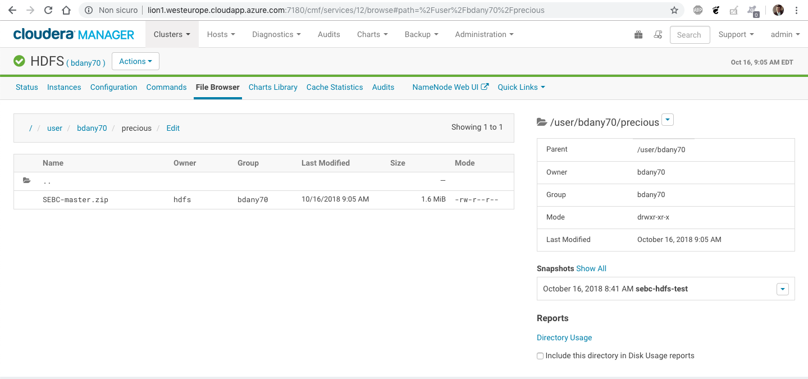
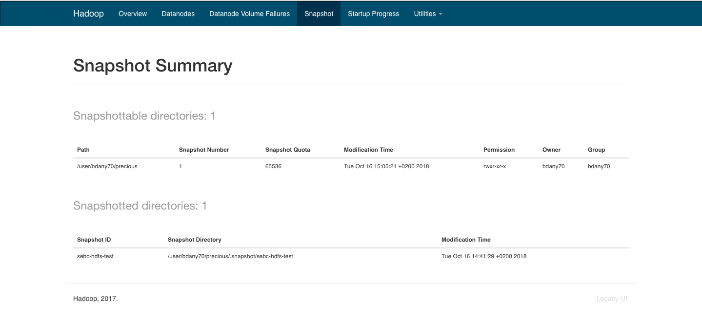

### Create precious dir

```shell
[bdany70@elephant ~]$ hdfs dfs -mkdir precious
```

### Copy the file

```shell
[bdany70@elephant ~]$ hdfs dfs -copyFromLocal /tmp/SEBC-master.zip precious
```

### Enable snapshot



### Create snapshot



### Snapshot created



### Delete directory

```shell
[bdany70@elephant ~]$ hdfs dfs -rm -r -f precious
rm: Failed to move to trash: hdfs://elephant:8020/user/bdany70/precious: The directory /user/bdany70/precious cannot be deleted since /user/bdany70/precious is snapshottable and already has snapshots
```

It correctly cannot be erased

### Delete the file

```shell
[bdany70@elephant ~]$ hdfs dfs -rm precious/SEBC-master.zip
18/10/16 08:54:23 INFO fs.TrashPolicyDefault: Moved: 'hdfs://elephant:8020/user/bdany70/precious/SEBC-master.zip' to trash at: hdfs://elephant:8020/user/bdany70/.Trash/Current/user/bdany70/precious/SEBC-master.zip
```

### Empty trash

```shell
[bdany70@elephant ~]$ hadoop fs -expunge
18/10/16 08:56:30 WARN hdfs.DFSClient: Cannot get all encrypted trash roots
org.apache.hadoop.ipc.RemoteException(org.apache.hadoop.security.AccessControlException): Access denied for user bdany70. Superuser privilege is required
	at org.apache.hadoop.hdfs.server.namenode.FSPermissionChecker.checkSuperuserPrivilege(FSPermissionChecker.java:93)
	at org.apache.hadoop.hdfs.server.namenode.FSNamesystem.checkSuperuserPrivilege(FSNamesystem.java:6745)
	at org.apache.hadoop.hdfs.server.namenode.FSNamesystem.listEncryptionZones(FSNamesystem.java:9371)
	at org.apache.hadoop.hdfs.server.namenode.NameNodeRpcServer.listEncryptionZones(NameNodeRpcServer.java:1656)
	at org.apache.hadoop.hdfs.server.namenode.AuthorizationProviderProxyClientProtocol.listEncryptionZones(AuthorizationProviderProxyClientProtocol.java:942)
	at org.apache.hadoop.hdfs.protocolPB.ClientNamenodeProtocolServerSideTranslatorPB.listEncryptionZones(ClientNamenodeProtocolServerSideTranslatorPB.java:1397)
	at org.apache.hadoop.hdfs.protocol.proto.ClientNamenodeProtocolProtos$ClientNamenodeProtocol$2.callBlockingMethod(ClientNamenodeProtocolProtos.java)
	at org.apache.hadoop.ipc.ProtobufRpcEngine$Server$ProtoBufRpcInvoker.call(ProtobufRpcEngine.java:617)
	at org.apache.hadoop.ipc.RPC$Server.call(RPC.java:1073)
	at org.apache.hadoop.ipc.Server$Handler$1.run(Server.java:2226)
	at org.apache.hadoop.ipc.Server$Handler$1.run(Server.java:2222)
	at java.security.AccessController.doPrivileged(Native Method)
	at javax.security.auth.Subject.doAs(Subject.java:422)
	at org.apache.hadoop.security.UserGroupInformation.doAs(UserGroupInformation.java:1920)
	at org.apache.hadoop.ipc.Server$Handler.run(Server.java:2220)

	at org.apache.hadoop.ipc.Client.call(Client.java:1504)
	at org.apache.hadoop.ipc.Client.call(Client.java:1441)
	at org.apache.hadoop.ipc.ProtobufRpcEngine$Invoker.invoke(ProtobufRpcEngine.java:230)
	at com.sun.proxy.$Proxy10.listEncryptionZones(Unknown Source)
	at org.apache.hadoop.hdfs.protocolPB.ClientNamenodeProtocolTranslatorPB.listEncryptionZones(ClientNamenodeProtocolTranslatorPB.java:1402)
	at sun.reflect.NativeMethodAccessorImpl.invoke0(Native Method)
	at sun.reflect.NativeMethodAccessorImpl.invoke(NativeMethodAccessorImpl.java:62)
	at sun.reflect.DelegatingMethodAccessorImpl.invoke(DelegatingMethodAccessorImpl.java:43)
	at java.lang.reflect.Method.invoke(Method.java:498)
	at org.apache.hadoop.io.retry.RetryInvocationHandler.invokeMethod(RetryInvocationHandler.java:258)
	at org.apache.hadoop.io.retry.RetryInvocationHandler.invoke(RetryInvocationHandler.java:104)
	at com.sun.proxy.$Proxy11.listEncryptionZones(Unknown Source)
	at org.apache.hadoop.hdfs.protocol.EncryptionZoneIterator.makeRequest(EncryptionZoneIterator.java:55)
	at org.apache.hadoop.hdfs.protocol.EncryptionZoneIterator.makeRequest(EncryptionZoneIterator.java:33)
	at org.apache.hadoop.fs.BatchedRemoteIterator.makeRequest(BatchedRemoteIterator.java:77)
	at org.apache.hadoop.fs.BatchedRemoteIterator.makeRequestIfNeeded(BatchedRemoteIterator.java:85)
	at org.apache.hadoop.fs.BatchedRemoteIterator.hasNext(BatchedRemoteIterator.java:99)
	at org.apache.hadoop.hdfs.DistributedFileSystem.getTrashRoots(DistributedFileSystem.java:2411)
	at org.apache.hadoop.fs.TrashPolicyDefault.deleteCheckpoint(TrashPolicyDefault.java:194)
	at org.apache.hadoop.fs.Trash.expunge(Trash.java:119)
	at org.apache.hadoop.fs.shell.Delete$Expunge.processArguments(Delete.java:209)
	at org.apache.hadoop.fs.shell.FsCommand.processRawArguments(FsCommand.java:118)
	at org.apache.hadoop.fs.shell.Command.run(Command.java:165)
	at org.apache.hadoop.fs.FsShell.run(FsShell.java:315)
	at org.apache.hadoop.util.ToolRunner.run(ToolRunner.java:70)
	at org.apache.hadoop.util.ToolRunner.run(ToolRunner.java:84)
	at org.apache.hadoop.fs.FsShell.main(FsShell.java:372)
18/10/16 08:56:30 INFO fs.TrashPolicyDefault: TrashPolicyDefault#deleteCheckpoint for trashRoot: hdfs://elephant:8020/user/bdany70/.Trash
18/10/16 08:56:30 INFO fs.TrashPolicyDefault: TrashPolicyDefault#deleteCheckpoint for trashRoot: hdfs://elephant:8020/user/bdany70/.Trash
18/10/16 08:56:30 WARN hdfs.DFSClient: Cannot get all encrypted trash roots
org.apache.hadoop.ipc.RemoteException(org.apache.hadoop.security.AccessControlException): Access denied for user bdany70. Superuser privilege is required
	at org.apache.hadoop.hdfs.server.namenode.FSPermissionChecker.checkSuperuserPrivilege(FSPermissionChecker.java:93)
	at org.apache.hadoop.hdfs.server.namenode.FSNamesystem.checkSuperuserPrivilege(FSNamesystem.java:6745)
	at org.apache.hadoop.hdfs.server.namenode.FSNamesystem.listEncryptionZones(FSNamesystem.java:9371)
	at org.apache.hadoop.hdfs.server.namenode.NameNodeRpcServer.listEncryptionZones(NameNodeRpcServer.java:1656)
	at org.apache.hadoop.hdfs.server.namenode.AuthorizationProviderProxyClientProtocol.listEncryptionZones(AuthorizationProviderProxyClientProtocol.java:942)
	at org.apache.hadoop.hdfs.protocolPB.ClientNamenodeProtocolServerSideTranslatorPB.listEncryptionZones(ClientNamenodeProtocolServerSideTranslatorPB.java:1397)
	at org.apache.hadoop.hdfs.protocol.proto.ClientNamenodeProtocolProtos$ClientNamenodeProtocol$2.callBlockingMethod(ClientNamenodeProtocolProtos.java)
	at org.apache.hadoop.ipc.ProtobufRpcEngine$Server$ProtoBufRpcInvoker.call(ProtobufRpcEngine.java:617)
	at org.apache.hadoop.ipc.RPC$Server.call(RPC.java:1073)
	at org.apache.hadoop.ipc.Server$Handler$1.run(Server.java:2226)
	at org.apache.hadoop.ipc.Server$Handler$1.run(Server.java:2222)
	at java.security.AccessController.doPrivileged(Native Method)
	at javax.security.auth.Subject.doAs(Subject.java:422)
	at org.apache.hadoop.security.UserGroupInformation.doAs(UserGroupInformation.java:1920)
	at org.apache.hadoop.ipc.Server$Handler.run(Server.java:2220)

	at org.apache.hadoop.ipc.Client.call(Client.java:1504)
	at org.apache.hadoop.ipc.Client.call(Client.java:1441)
	at org.apache.hadoop.ipc.ProtobufRpcEngine$Invoker.invoke(ProtobufRpcEngine.java:230)
	at com.sun.proxy.$Proxy10.listEncryptionZones(Unknown Source)
	at org.apache.hadoop.hdfs.protocolPB.ClientNamenodeProtocolTranslatorPB.listEncryptionZones(ClientNamenodeProtocolTranslatorPB.java:1402)
	at sun.reflect.NativeMethodAccessorImpl.invoke0(Native Method)
	at sun.reflect.NativeMethodAccessorImpl.invoke(NativeMethodAccessorImpl.java:62)
	at sun.reflect.DelegatingMethodAccessorImpl.invoke(DelegatingMethodAccessorImpl.java:43)
	at java.lang.reflect.Method.invoke(Method.java:498)
	at org.apache.hadoop.io.retry.RetryInvocationHandler.invokeMethod(RetryInvocationHandler.java:258)
	at org.apache.hadoop.io.retry.RetryInvocationHandler.invoke(RetryInvocationHandler.java:104)
	at com.sun.proxy.$Proxy11.listEncryptionZones(Unknown Source)
	at org.apache.hadoop.hdfs.protocol.EncryptionZoneIterator.makeRequest(EncryptionZoneIterator.java:55)
	at org.apache.hadoop.hdfs.protocol.EncryptionZoneIterator.makeRequest(EncryptionZoneIterator.java:33)
	at org.apache.hadoop.fs.BatchedRemoteIterator.makeRequest(BatchedRemoteIterator.java:77)
	at org.apache.hadoop.fs.BatchedRemoteIterator.makeRequestIfNeeded(BatchedRemoteIterator.java:85)
	at org.apache.hadoop.fs.BatchedRemoteIterator.hasNext(BatchedRemoteIterator.java:99)
	at org.apache.hadoop.hdfs.DistributedFileSystem.getTrashRoots(DistributedFileSystem.java:2411)
	at org.apache.hadoop.fs.TrashPolicyDefault.createCheckpoint(TrashPolicyDefault.java:184)
	at org.apache.hadoop.fs.TrashPolicyDefault.createCheckpoint(TrashPolicyDefault.java:179)
	at org.apache.hadoop.fs.Trash.checkpoint(Trash.java:114)
	at org.apache.hadoop.fs.shell.Delete$Expunge.processArguments(Delete.java:210)
	at org.apache.hadoop.fs.shell.FsCommand.processRawArguments(FsCommand.java:118)
	at org.apache.hadoop.fs.shell.Command.run(Command.java:165)
	at org.apache.hadoop.fs.FsShell.run(FsShell.java:315)
	at org.apache.hadoop.util.ToolRunner.run(ToolRunner.java:70)
	at org.apache.hadoop.util.ToolRunner.run(ToolRunner.java:84)
	at org.apache.hadoop.fs.FsShell.main(FsShell.java:372)
18/10/16 08:56:30 INFO fs.TrashPolicyDefault: TrashPolicyDefault#createCheckpoint for trashRoot: hdfs://elephant:8020/user/bdany70/.Trash
18/10/16 08:56:30 INFO fs.TrashPolicyDefault: Created trash checkpoint: /user/bdany70/.Trash/181016085630
```

### Verify empty trash

```shell
[bdany70@elephant ~]$ hdfs dfs -ls .Trash
Found 1 items
drwx------   - bdany70 bdany70          0 2018-10-16 08:52 .Trash/181016085630
```

### Start restore



### Restore completed



### Verify restore



### Snapshots list

